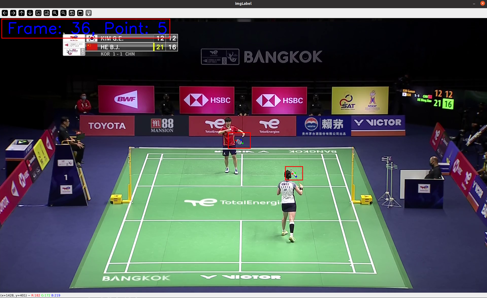

# 羽毛球拍标注工具使用
## 下载
```
git clone https://github.com/haowuxc/BadmintonLabelTool
```
## 环境配置
```
pip install opencv-python
```
## 开始标注
标注新视频
```
python imgLabelBat.py --label_video_path VIDEO_PATH
```
继续使用之前的csv文件标注
```
python imgLabelBat.py --label_video_path VIDEO_PATH  --csv_path LABELED_CSV_PATH
```
鼠标标注
- 左键点击：左击对应位置完成标注，如果点错位置，可以重新点击，仅记录切换到下一个标注点前的最后一次点击位置
- 中键点击/右键点击：取消刚才的标注

键盘快捷键
- e: 退出程序
- s: 保存当前的标注到文件
- n: 切换到下一帧
- p: 切换到上一帧
- f: 切换到第一帧
- l: 切换到最后一帧
- \>:向前切换36帧
- <: 向后切换36帧
- o: 切换到上一个点
- q: 切换到下一个点

## 示例
下图是一个标注页面，左上角会显示当前的帧数和正在标第几个点，标注的6个点颜色依次为红绿蓝红绿蓝（RGBRGB）


